# AACS3064 Computer Systems Architecture

<p align="center">
  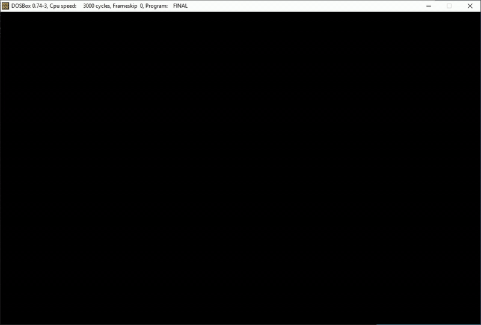
</p>

8086 assembly assignment project for **AACS3064 Computer Systems Architecture**. The program implements a DOS-based UMT Bookstore POS system with login, menu navigation, product display, purchase calculation, payment, sales report, and exit flow.

## Project Scope

This repository is a cleaned public snapshot of the historical project from `C:\8086\Final`.

Included:

- Main source file: `src/FINAL.asm`
- DOS tools in `tools/dos/`
- Documentation for setup, flow, formulas, and manual verification

Not included:

- Generated build files such as `FINAL.OBJ` and `FINAL.EXE`
- Raw coursework PDF/DOCX files that contain student IDs or declaration/signature material

## Repository Layout

```text
.
|-- assets/
|   |-- gif/
|   |-- screenshots/
|   `-- video/
|-- docs/
|   |-- 8086-notes.md
|   |-- animation.md
|   |-- formulas.md
|   |-- manual-test-checklist.md
|   `-- source-map.md
|-- src/
|   `-- FINAL.asm
|-- tools/
|   `-- dos/
|-- LICENSE
|-- .gitignore
`-- README.md
```

## Requirements

- DOSBox
- A copy of this repository or the `src/FINAL.asm` file placed somewhere DOSBox can mount

## DOSBox Setup

Mount the repository root as drive `C:` inside DOSBox:

```dos
mount c: c:\path\to\repo
c:
cd src
```

Hotkey:

```text
Alt + Enter = fullscreen
```

## Build And Run

From the folder containing `FINAL.asm`:

```dos
path c:\tools\dos
masm final;
link final;
final.exe
```

MASM produces `FINAL.OBJ`, LINK produces `FINAL.EXE`, and the executable starts the bookstore system.

Generated files are ignored by Git.

## Demo Login

The current source contains these demo credentials:

```text
Username: Burger
Password: admin123
```

The password input is hidden on screen.

## Program Flow

1. **Startup intro**
   - Shows the TAR UMT Programming Bookstore title screen.
   - Uses typing-style animation and delay routines.

2. **Login**
   - Prompts for username and password.
   - Supports backspace/delete behavior.
   - Enforces maximum input length.
   - Hides password input.
   - Validates credentials.
   - Triggers cooldown after repeated failed attempts.

   <p align="center">
     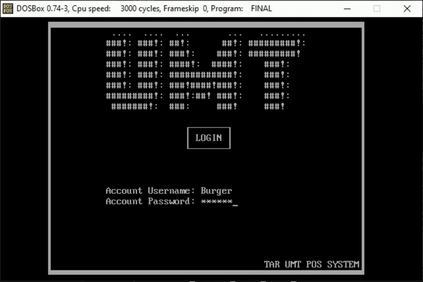
   </p>

3. **Main menu**
   - Displays the main bookstore menu.
   - Uses keyboard navigation.
   - Routes the user to display product, purchase, sales report, or exit.

4. **Display product**
   - Shows available books and prices:
     - JAVA: RM 23.79
     - Assembly: RM 15.50
     - JavaScript: RM 9.99

5. **Purchase**
   - Lets the user select products `1` to `3`.
   - Accepts quantity input, including values like `5` and `05`.
   - Rejects invalid product and quantity input.
   - Allows `X` to quit purchase with confirmation.
   - Allows `C` to confirm purchase.
   - Rejects confirmation when no product has been selected.

6. **Payment**
   - Prompts for cash amount.
   - Rejects invalid cash input.
   - Rejects amounts above RM9999.
   - Rejects more than two decimal places.
   - Rejects insufficient cash.
   - Calculates and displays change.

7. **Sales report**
   - Shows transaction count.
   - Shows accumulated quantity sold for each product.
   - Shows gross sales amount for each product.
   - Displays current date and time.

8. **Exit**
   - Confirms whether the user wants to exit.
   - Accepts uppercase and lowercase `Y`/`N`.
   - Rejects invalid confirmation input.
   - Plays an exit progress animation before termination.

   <p align="center">
     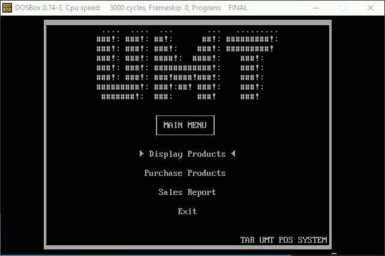
   </p>

## Formula Summary

```text
ProductAmount = ProductPrice * ProductQuantity
Subtotal = Product1Amount + Product2Amount + Product3Amount
Discount = 0 if Subtotal < RM75
Discount = 3% if Subtotal >= RM75
Discount = 7% if Subtotal >= RM150
SST = Subtotal * 5%
Total = Subtotal - Discount + SST
Change = Cash - Total
```

See [docs/formulas.md](docs/formulas.md) for the full sales report data model.

## 8086 Notes

Core implementation patterns used by this project:

- Initialize the data segment before accessing data labels:

  ```asm
  MOV AX,@DATA
  MOV DS,AX
  ```

- Print `$`-terminated strings through DOS interrupt `21h`, function `09h`:

  ```asm
  MOV AH,09H
  MOV DX,OFFSET MSG
  INT 21H
  ```

- Read characters through DOS interrupt `21h`.
- Move the cursor through BIOS interrupt `10h`.
- Use `SI` and `DI` for pointer-style memory access.
- Use macros to keep repeated UI, math, I/O, string, and animation logic manageable.
- Keep conditional jumps close enough for MASM, or jump through nearby labels when needed.

More notes are in [docs/8086-notes.md](docs/8086-notes.md).

## Implementation Docs

- [docs/source-map.md](docs/source-map.md): source layout and procedure map
- [docs/animation.md](docs/animation.md): intro, message box, cooldown, cursor, and exit animation notes

## Screenshots

| Flow | Screenshot |
| --- | --- |
| Intro | 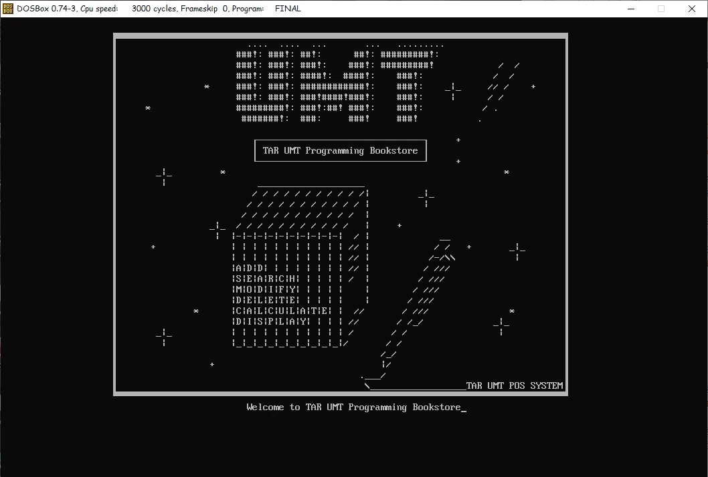 |
| Login | 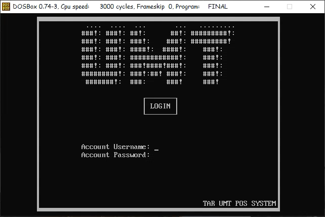 |
| Main menu | 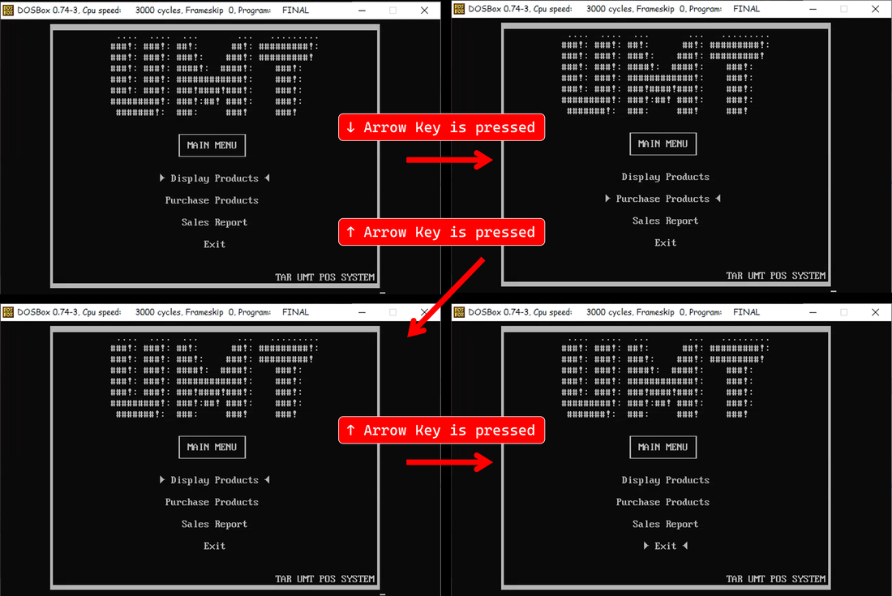 |
| Display products | 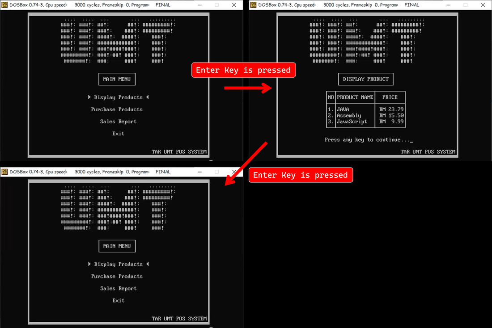 |
| Purchase confirmation | 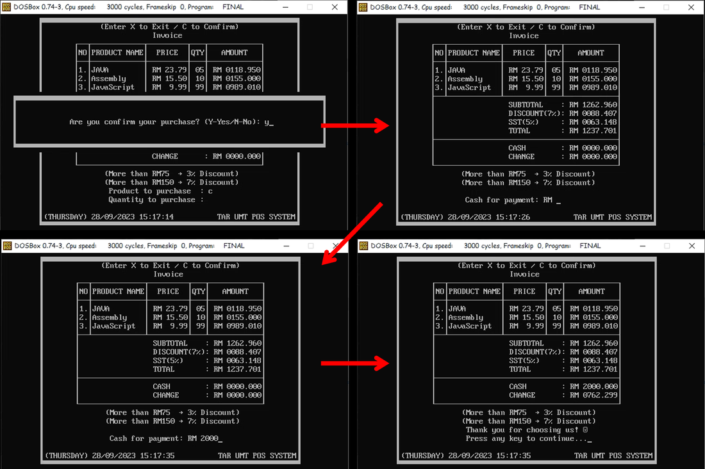 |
| Payment change | 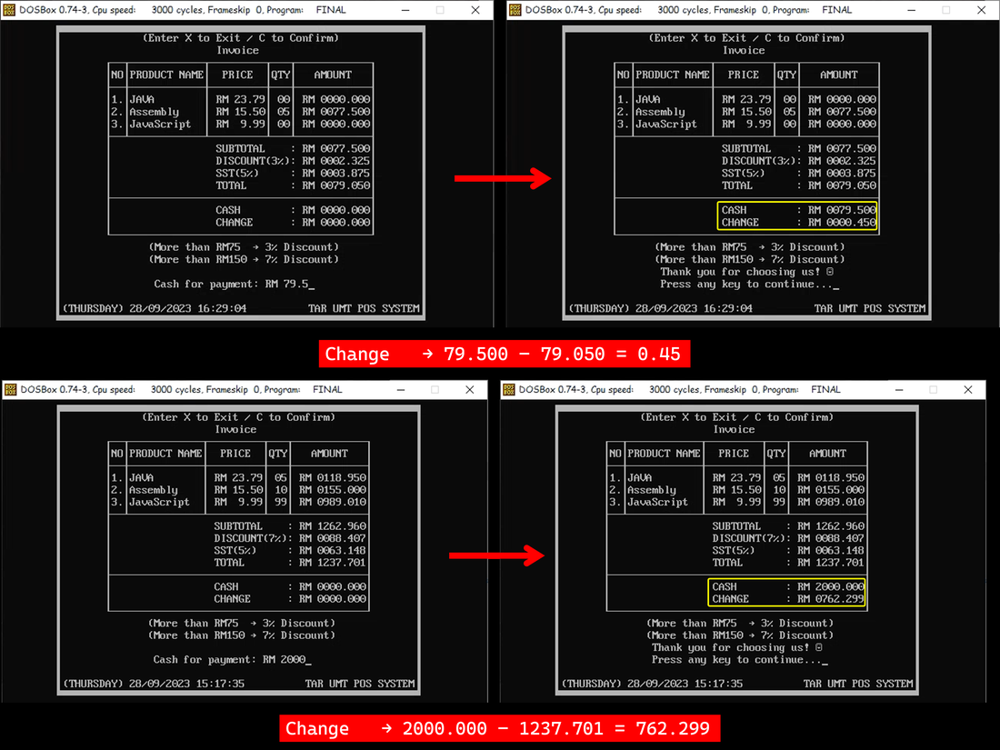 |
| Sales report | 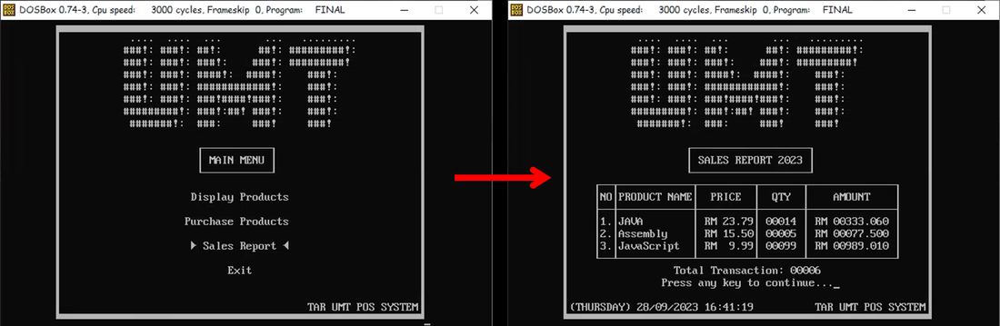 |
| Exit confirmation | 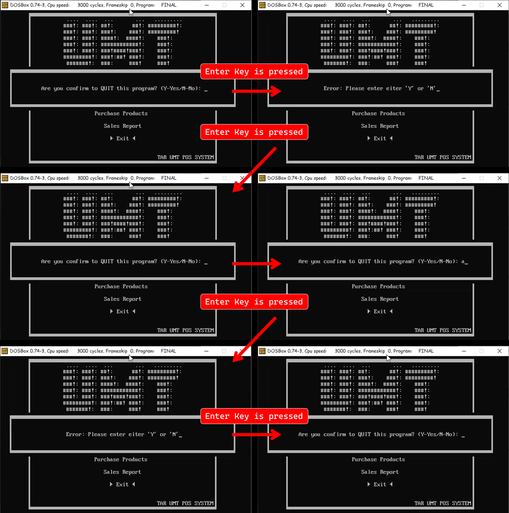 |

## Verification

Use [docs/manual-test-checklist.md](docs/manual-test-checklist.md) when checking the program in DOSBox.

## License

Project source code is licensed under the MIT License. See [LICENSE](LICENSE).

Coursework exports, screenshots, generated binaries, and third-party DOS tools are outside that scope unless a file says otherwise.
